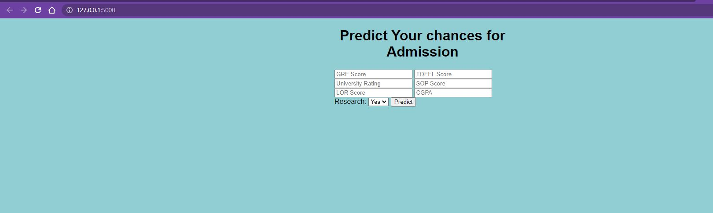
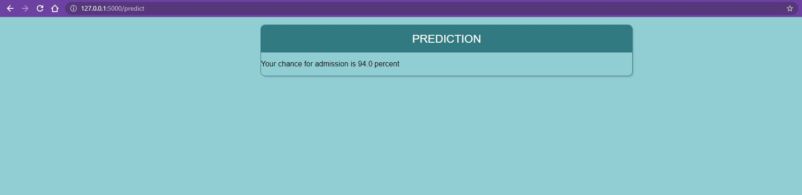

# Predicting-Graduate-Admissions-using-ML

The goal here is to create End to END machine learning model to predict the chance of admission of a candidate based on his/her GRE Score (out of 340), TOEFL Score (out of 120), rating of the University (out of 5) in which he/she
is trying to get admission, Strength of the SOP (out of 5), strength of the Letter Of Recommendation (out of 5), CGPA (out of 10) and the research experience (0 or 1).

# Life cycle of the project  
  1) Data cleaning
  2) Creating Machine learning Model
  3) Saving and loading Machine learning model using Pickle
  3) Creating a Flask Web-app
  4) Deployed to Azure Web App

# Flask web-app landing page

# Flask web-app results page

